# Program 1 : Add two Integers
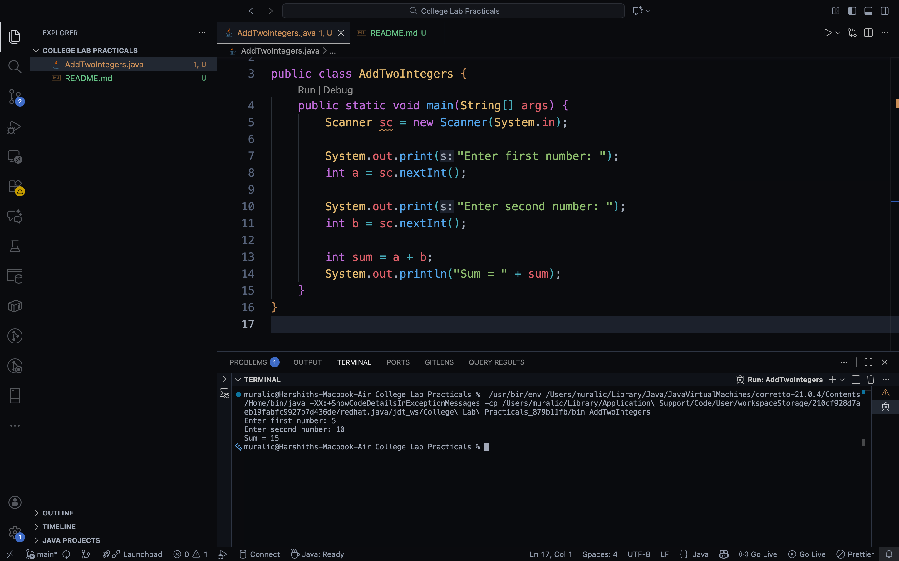

# Program 2 : Swap Numbers
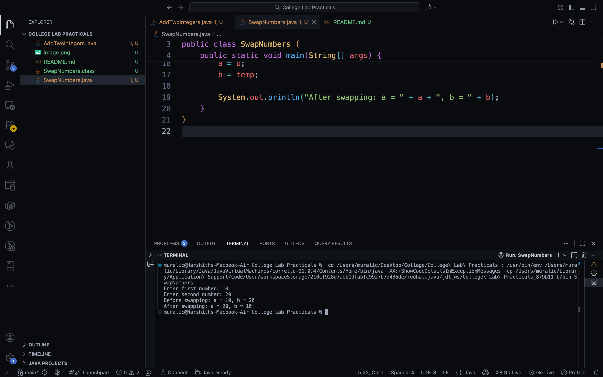

# Program 3 : Even or Odd Number
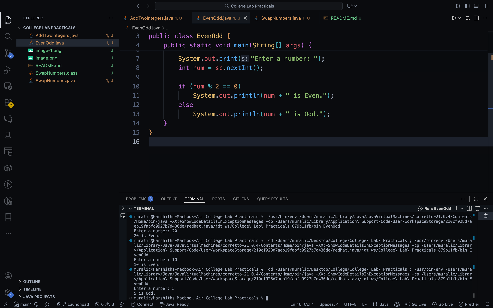

# Program 4 : Largest of 3 Numbers
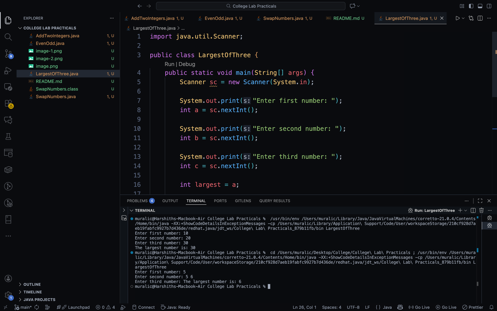

# Program 5 : Simple Calculator
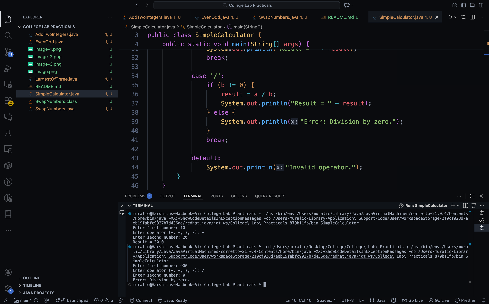

# Program 6 : Quadratic Roots
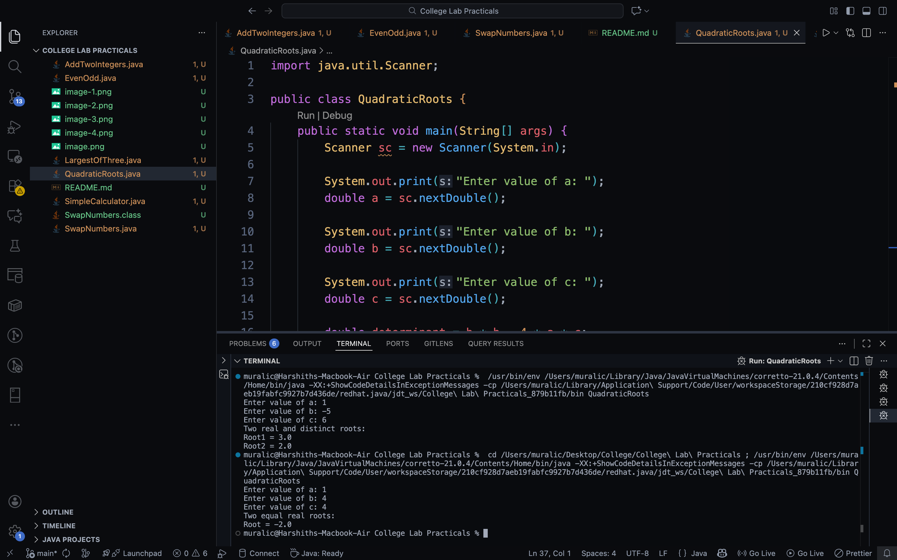

# Program 7 : SGPA Calculation
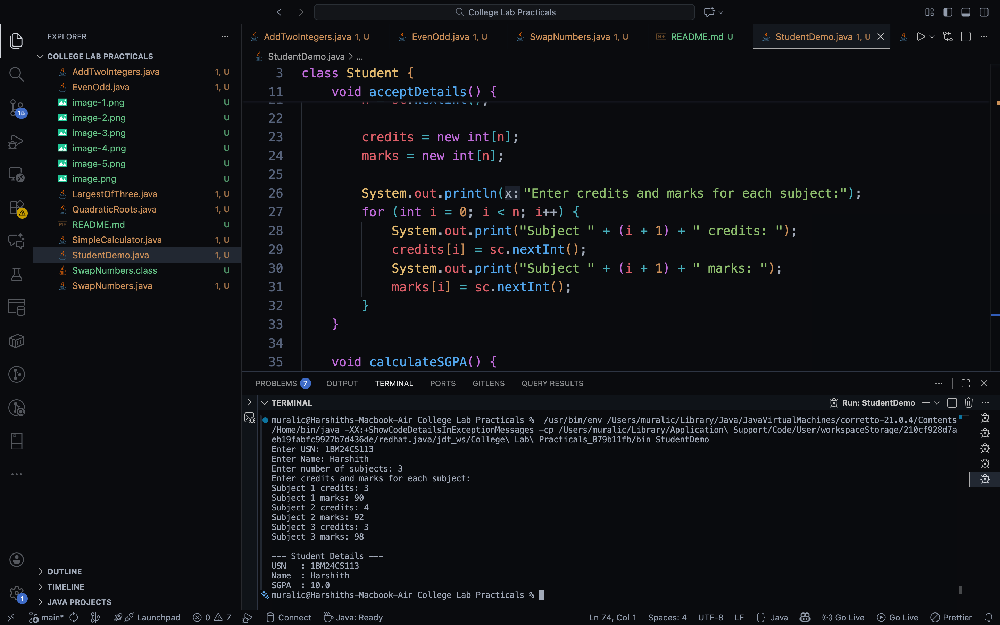

# Program 8 : Book Constructor
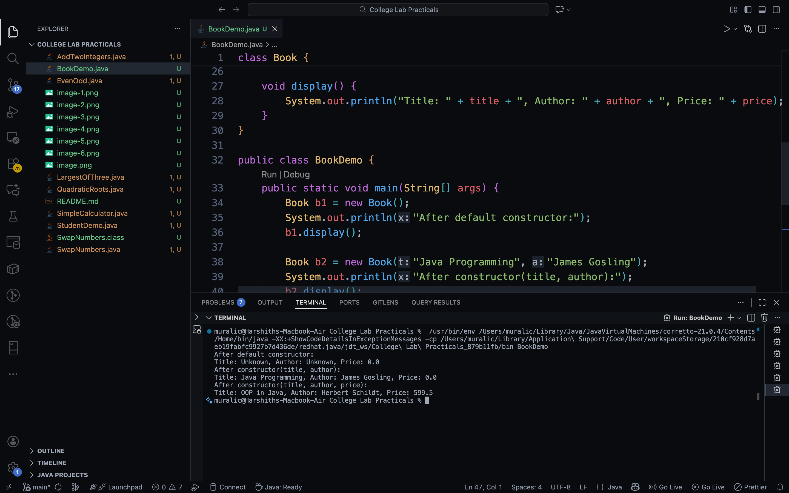

# Program 9 : Counter 
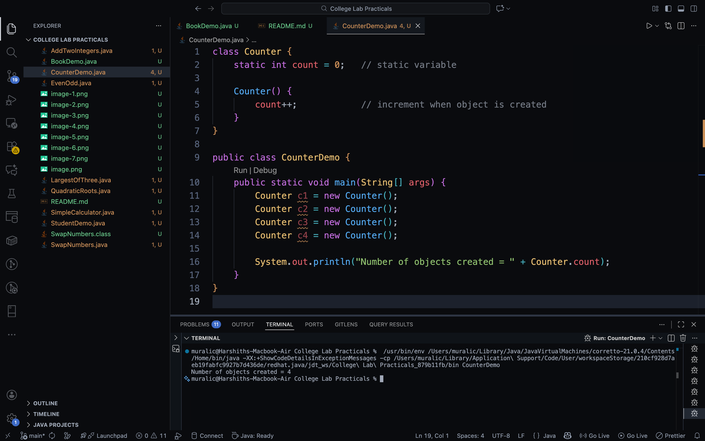

# Program 10 : Math Utility
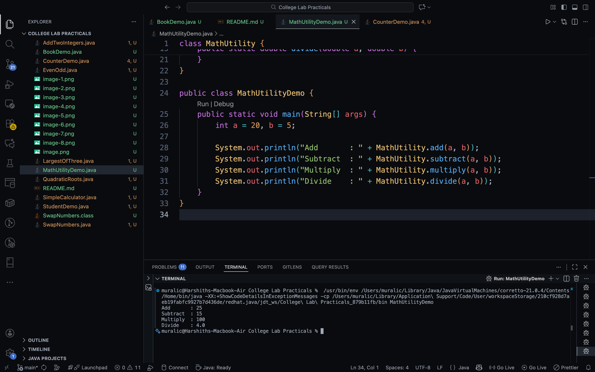

# Program 11 : Bank

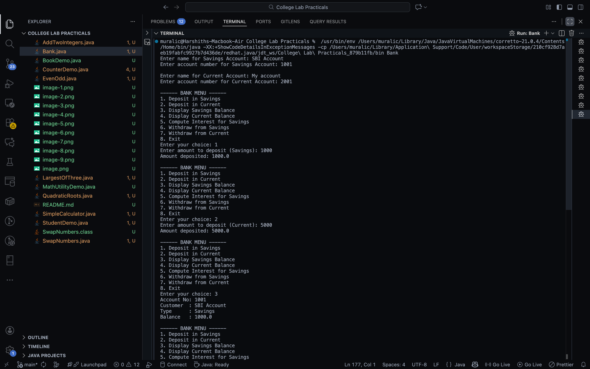

# Program 12 : Shape
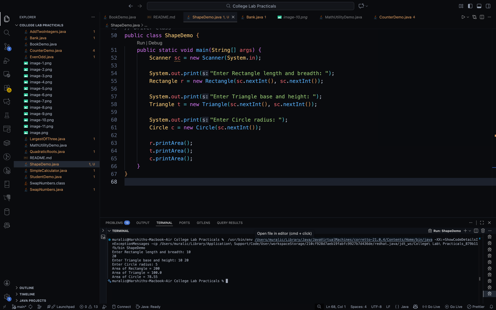

# Program 13 : String Methods
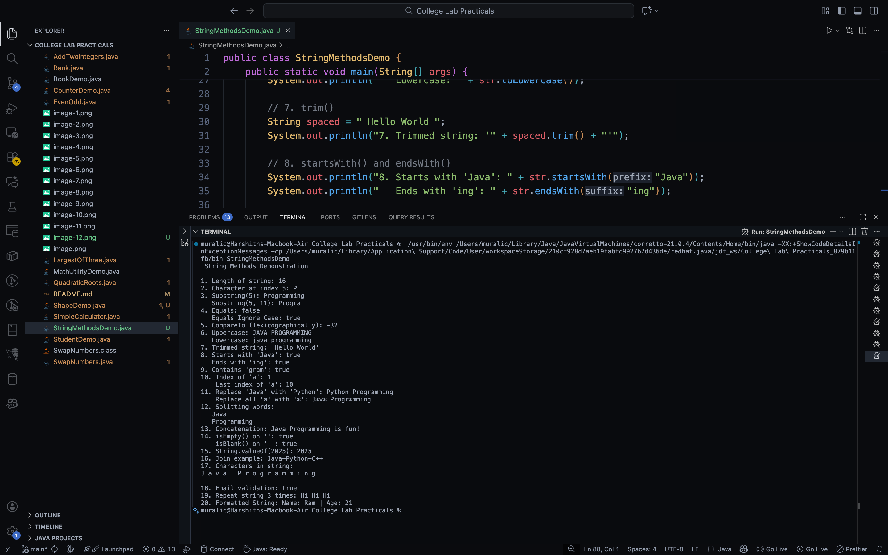

# Program 14 : String Builder Methods
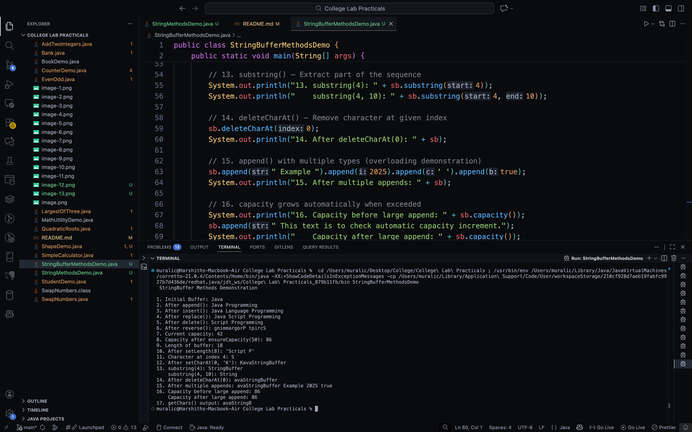

# Program 15 : Exception Handling
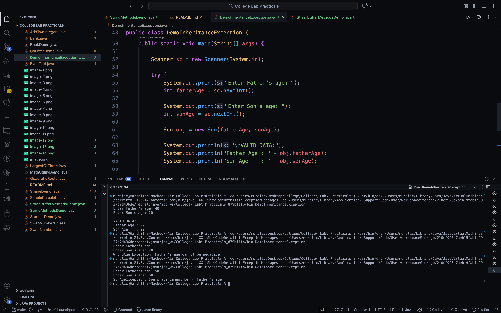

# Program 16 : Inheritance
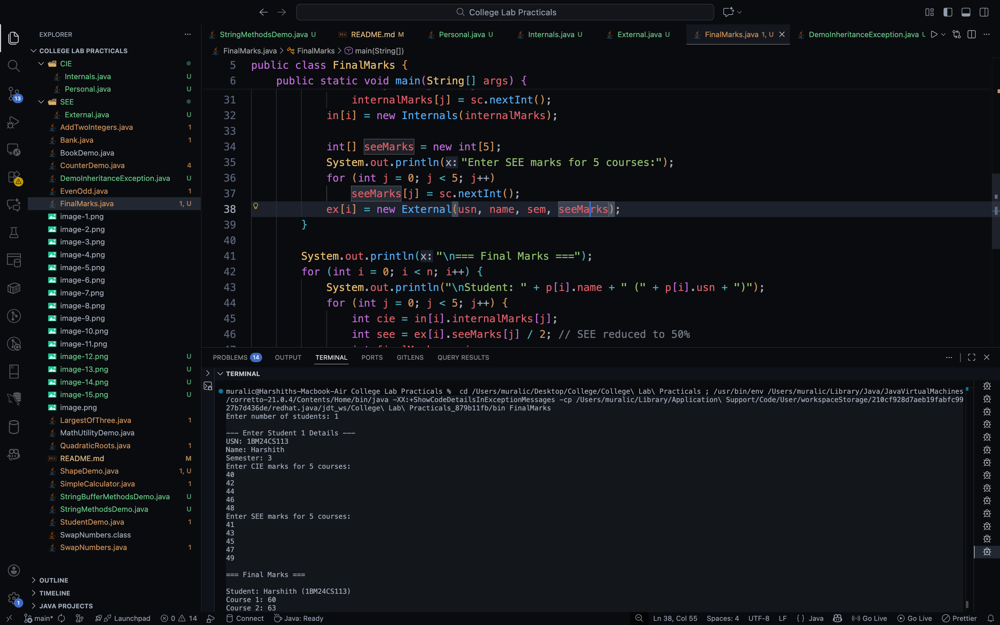